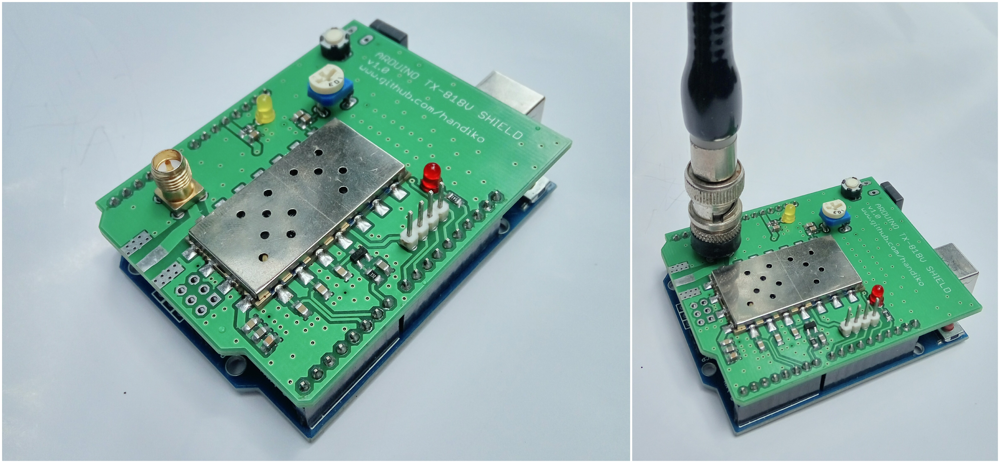
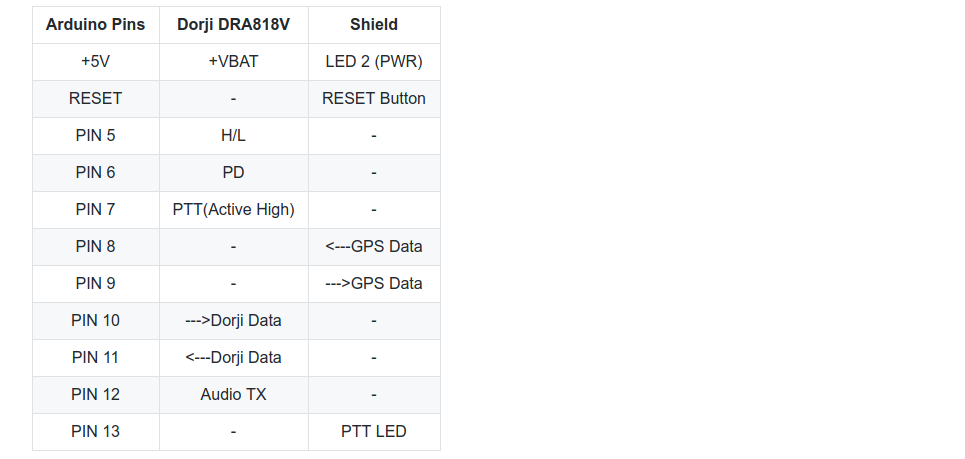
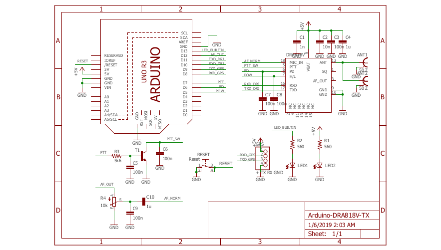

# Arduino UNO Shield for Dorji DRA818V/U Transmitter
Dorji DRA818V VHF transmitter module shield for Arduino UNO &amp; compatibles.
This Arduino shield is intended to used as an APRS Transmitter module based on Arduino UNO (see [my Arduino APRS GitHub page](https://github.com/handiko/Arduino-APRS).

## Photos

## Pinout

_Please note that in order to use PIN 8-11 as Serial Data lines, you need to use **SoftwareSerial** library._

## Schematic

## TODO
* Adding Silkscreen layer
* Adding ISP port capability
* Adding RX capability (maybe in a different repo..?)
* ...

## Acknowledgements
* Djoko Marjono Susilo - YB1TJ
* Adafruit Proto Shield PCB [GitHub page](https://github.com/adafruit/Adafruit-Proto-Shield-PCB)

## Contributing
1. Fork it [https://github.com/handiko/Dorji-TX-Shield/fork](https://github.com/handiko/Dorji-TX-Shield/fork)
2. Create new branch (`git checkout -b add-blah-blah`)
3. Do some editing / create new feature
4. Commit your works (`git commit -m "Adding some blah blah blah.."`)
5. Push to the branch (`git push -u origin add-blah-blah`)
6. Create a new Pull Request
